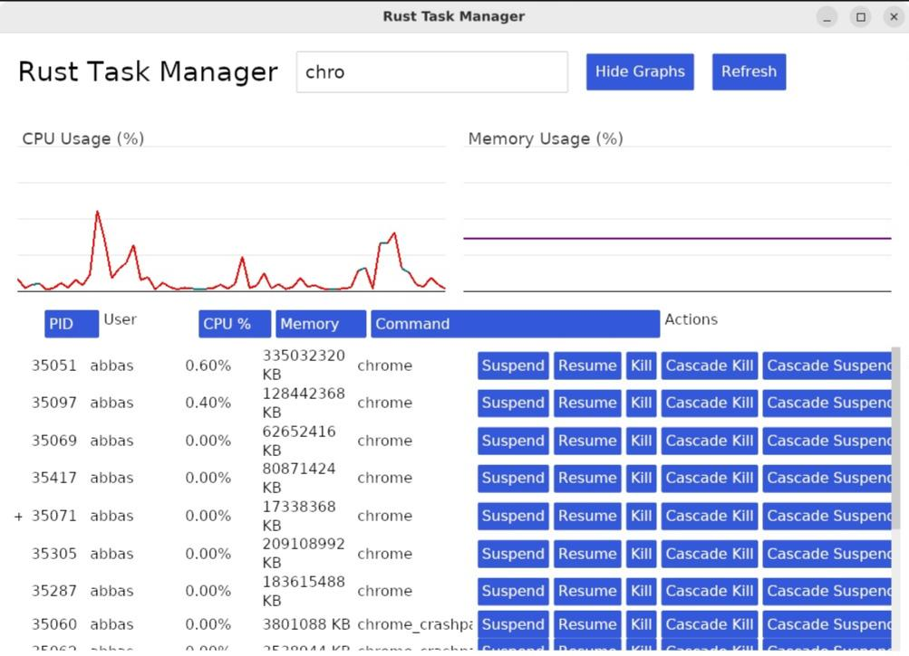

# RustProcSentry

A Rust-based application for listing, monitoring, and controlling system processes in Linux. It combines a Command-Line Interface (CLI) and a Graphical User Interface (GUI) to give you total control over your processes.

---

## Features
- **CLI Control:** List, filter, and kill processes with flexible options (sort by PID, CPU, Memory, etc.).
- **GUI Interface:** View a hierarchical process tree, suspend/resume/kill single or multiple processes, and monitor real-time CPU & memory usage.
- **Security:** Restricts CLI commands to a predefined set to prevent misuse.
- **Real-Time Updates:** Refresh process data automatically every second.
- **Graphs and Spike Detection:** Dynamically updated charts highlight CPU and memory spikes in red.

---

## Architecture
- **cli.rs**: Manages CLI arguments via `clap`. Runs restricted system commands.
- **data_structures.rs**: Holds the `ProcessInfo` struct and related data structures.
- **process_handler.rs**: Fetches system data using `sysinfo`; sends signals with `nix`.
- **ui.rs**: Builds the GUI with `iced`, handles user interactions, displays process tree, and shows CPU/memory charts.
- **main.rs**: Entry point for the GUI application.

## Future Enhancements
- **Enhanced Security:** Add authentication or `user-level` permissions.
- **Advanced Filtering:** `Multi-criteria` and `regex-based` searches.
- **Notifications:** Alert users of critical changes or significant usage spikes.
- **Performance Tweaks:** Optimize refresh cycles for systems with large process counts.
- **Cross-Platform:** Expand capabilities to macOS and Windows if needed

 
